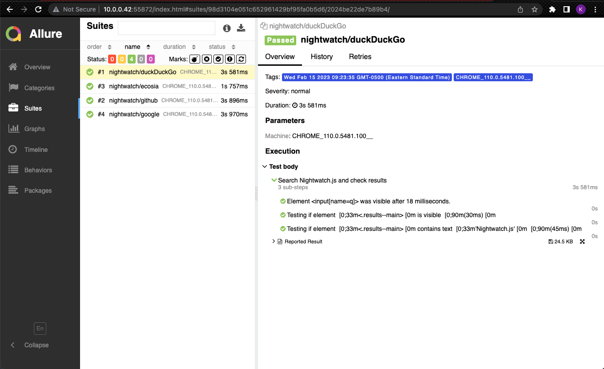

# How to implement Allure Report

➡️  npm install nightwatch-allure

➡️ npm install -g allure-commandline

➡️  Add following code to globals file in nightwatch
```js
const allureReporter = require('nightwatch-allure');
module.exports = {
  reporter: (results,done)=>{
    const reporter = new allureReporter.NightwatchAllureReporter({});
    reporter.write(results,done);
  }
};
```
➡️  Create a new script in package.json file
```js
"scripts": {
    ...
    "generateReport": "allure generate ./allure-results --clean && allure open",
    ...
  },
```
➡️  After test execution, enter `npm run generateReport`

or

```js
"scripts": {
    ...
    "test": "nightwatch && npm run generateReport",
    ...
  },
```
➡️  `npm run test`

</br>


| Report Sample |  
| :--- | 
|  |
